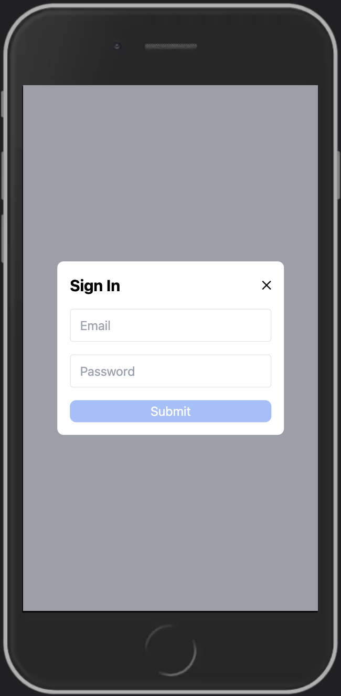
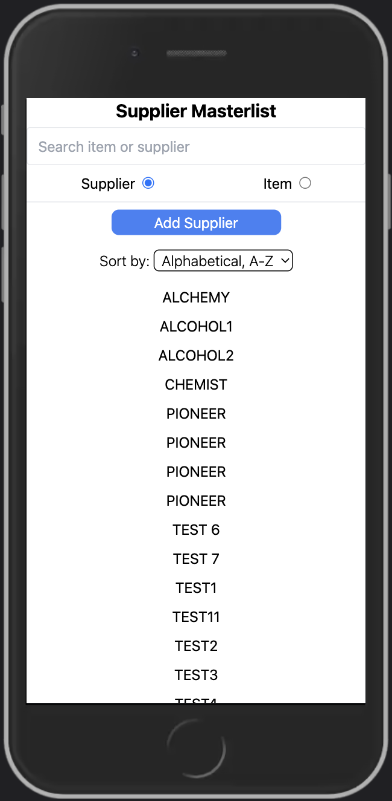

# FFCIPAD

FFCIPAD is a freelance project built using Angular, TailwindCSS, and Firebase.

---

# Features

The application solves the problem of the client for managing suppliers for their business. It includes CRUD functionality, for viewing supplier details, adding and editing a supplier, and also deleting a supplier.

Users can also search for a supplier or an item a supplier is selling and it will dynamically show the list of suppliers on the masterlist page.

Users can also sort the suppliers alphabetically, by rating, and by the price of the searched item.

Input elements have validations so that the user can get a feedback if they inputted a wrong value.

---

# Future plans for the application

As someone who worked in a manufacturing company, I can see the potential for the application to evolve into a full fledged management system for businesses looking to organize suppliers, item inventory, costs and expenses, etc...

The application can still be improved with a better ui and more reusable components. It also does not look good when viewed in desktop. That could probably be fixed by showing a more detailed table for suppliers in the masterlist page.

---

# Sample Screenshots

  

    
    
Welcome Page

  

  

    
    
Sign In Modal

  

  

    
    
Sign in Modal with Error Handling

  

  

    
    
Supplier Masterlist

  

  

    
    
Add Supplier Modal 1

  

  

    
    
Add Supplier Modal 2

  

